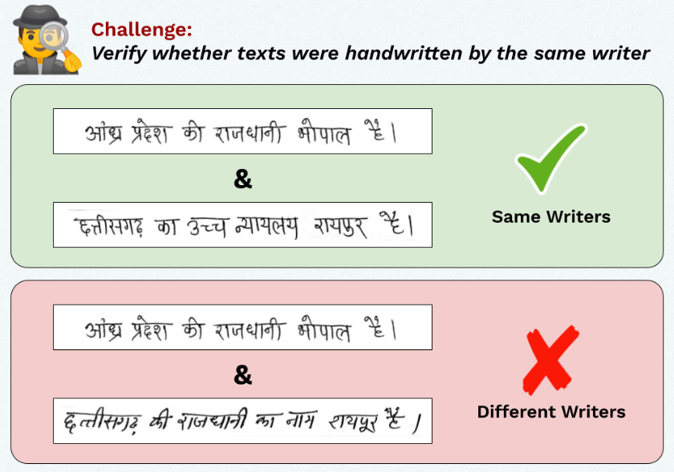

# NCVPRIPG 2023 Challenge on Writer Verification (Finalist Solution)



**Challenge Webpage**: [Summer Challenge on Writer Verification, under NCVPRIPG'23](https://vl2g.github.io/challenges/wv2023)  
**Web Link**: [Winning the NCVPRIPG23 Challenge on Writer Verification](https://mohitsharma-iitj.github.io/ncvpripg23_writer_verification/)  
**Kaggle Link**: [Summer Challenge on Writer Verification](https://www.kaggle.com/competitions/summer-challenge-on-writer-verification23-finale/leaderboard)  
**Team Name**: Alpha  
**Summary Paper**: `assets/NCVPRIPG23_Writer_Verification.pdf`


## Environment
Install the required libraries.
```shell
python3 -m pip install requirement.txt
pip install gdown
# to upgrade
pip install --upgrade gdown
```


Create the required directories.
```shell
mkdir notebook
cd notebook
gdown 'https://drive.google.com/drive/folders/1z2p7_cd33m0PG1qxrrceCGnGylLJonSy?usp=sharing'
```
Download and extract the dataset train and val(to train the model again) and test(to evaluate model on both self trained and pretrained) CSVs in `data/raw`.
```shell
cd notebook/train
gdown 'https://drive.google.com/drive/folders/1z2p7_cd33m0PG1qxrrceCGnGylLJonSy?usp=sharing'
cd ../val
gdown 'https://drive.google.com/drive/folders/1z2p7_cd33m0PG1qxrrceCGnGylLJonSy?usp=sharing'
cd ../test
gdown 'https://drive.google.com/drive/folders/1z2p7_cd33m0PG1qxrrceCGnGylLJonSy?usp=sharing'
```
NOTE: you can also add your data in folder manually.

## Download Checkpoints
The checkpoint for the best trained model can be found at [Google Drive](https://drive.google.com/drive/folders/1AAAuh62G2LHKOPOJvhUkUuC7w6SMKvzI?usp=sharing). Above command install it automaticlly. You can also download this and store it at a desired location. For downloading, you can use [gdown](https://github.com/wkentaro/gdown).

```shell
mkdir pretrained
cd pretrained
gdown 'https://drive.google.com/uc?id=1848Iu-JKXWSBgFvBN50-l-ZXXKgqkRJf'
```

## Generating Results on Test Set
On pretrained model (take input from notebook/test)
```shell
python test_pretrained.py 
```
On pretrained data (take input from notebook/train , notebook/test ,notebook/val ).
Have to train it first.
```shell
python train.py 
python test.py 
```

## Training

To train the model again, extract the base code and run code below.

To start training, run
```shell
python train.py
```

To reproduce the best results, pass the best config
```shell
python train.py --config cfgs/best.yml
```
